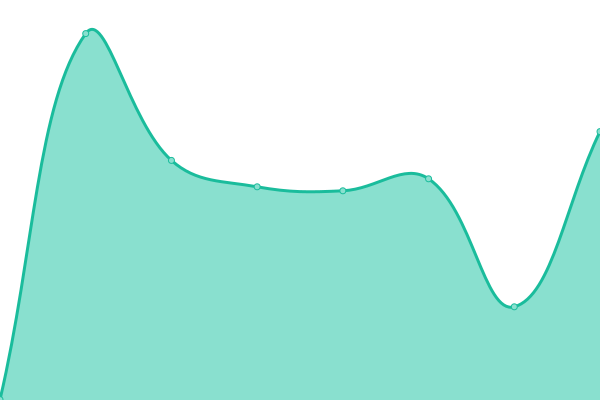
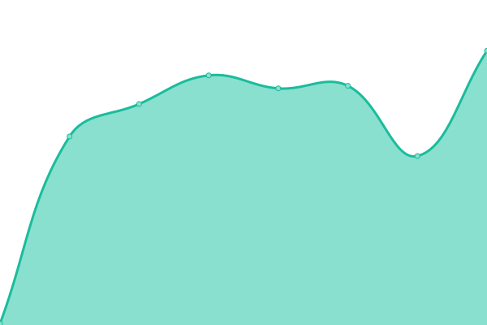

# [📈 Live Status](https://xjohnyknox.github.io/upptime): <!--live status--> **🟩 All systems operational**

This repository contains the open-source uptime monitor and status page for [Johny Jiménez](www.xjohnyx.me), powered by [Upptime](https://github.com/upptime/upptime).

With [Upptime](https://upptime.js.org), you can get your own unlimited and free uptime monitor and status page, powered entirely by a GitHub repository. We use [Issues](https://github.com/xjohnyknox/upptime/issues) as incident reports, [Actions](https://github.com/xjohnyknox/upptime/actions) as uptime monitors, and [Pages](https://xjohnyknox.github.io/upptime) for the status page.

<!--start: status pages-->
<!-- This summary is generated by Upptime (https://github.com/upptime/upptime) -->
<!-- Do not edit this manually, your changes will be overwritten -->
<!-- prettier-ignore -->
| URL | Status | History | Response Time | Uptime |
| --- | ------ | ------- | ------------- | ------ |
|  [OpenMind](https://tuopenmind.com/) | 🟩 Up | [open-mind.yml](https://github.com/xjohnyknox/upptime/commits/HEAD/history/open-mind.yml) | 

 578ms
     
 | 

<a href="https://xjohnyknox.github.io/upptime/history/open-mind">100.00%</a>
    

|  [Podea UNAL](http://podea.unal.edu.co/) | 🟩 Up | [podea-unal.yml](https://github.com/xjohnyknox/upptime/commits/HEAD/history/podea-unal.yml) | 

 2653ms
     
 | 

<a href="https://xjohnyknox.github.io/upptime/history/podea-unal">100.00%</a>
    

|  [xjohnyx](http://xjohnyx.me/) | 🟩 Up | [xjohnyx.yml](https://github.com/xjohnyknox/upptime/commits/HEAD/history/xjohnyx.yml) | 

 205ms
     
 | 

<a href="https://xjohnyknox.github.io/upptime/history/xjohnyx">100.00%</a>
    

<!--end: status pages-->

[**Visit our status website →**](https://xjohnyknox.github.io/upptime)

## 📄 License

- Powered by: [Upptime](https://github.com/upptime/upptime)
- Code: [MIT](./LICENSE) © [Johny Jiménez](www.xjohnyx.me)
- Data in the `./history` directory: [Open Database License](https://opendatacommons.org/licenses/odbl/1-0/)
